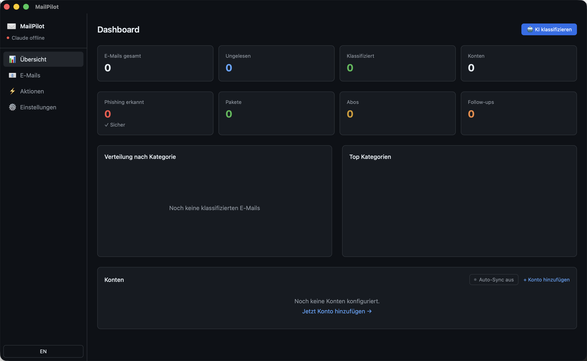

<div align="center">
  
  <h1>MailPilot</h1>
  <p>KI-gestützter E-Mail-Organizer mit intelligenter Kategorisierung, Review-Workflow und Multi-Account IMAP</p>
</div>

[🇬🇧 English Version](README.md)

[](https://github.com/9t29zhmwdh-coder/MailPilot/actions)       [](https://github.com/9t29zhmwdh-coder/MailPilot/releases) [](LICENSE)

> **So läuft es:** MailPilot ist eine native Desktop-App, kein Server oder Browser-Tool. Sie öffnet sich als eigenes Fenster, ohne Tray-Icon oder Hintergrunddienst; sie synchronisiert und klassifiziert nur, während das Fenster geöffnet ist.



---

> 💾 [**Für macOS herunterladen**](https://github.com/9t29zhmwdh-coder/MailPilot/releases/latest/download/MailPilot.dmg) (DMG, immer das neueste Release) — nicht signiert/notarisiert, macOS Gatekeeper zeigt beim ersten Start eine "nicht verifizierter Entwickler"-Warnung (Rechtsklick → Öffnen, um das zu umgehen). Oder selbst aus dem Quellcode bauen, siehe Erste Schritte unten. Windows/Linux werden nicht gebaut: MailPilot nutzt den macOS-Schlüsselbund und wird nur auf macOS getestet.

---

> 🌱 Neu hier? → [Schritt-für-Schritt-Anleitung für Einsteiger](GETTING_STARTED.md)

---

MailPilot verbindet sich mit deinen IMAP-Postfächern, klassifiziert jede E-Mail mit **Claude (Anthropic API)** und lässt dich jede Entscheidung prüfen und korrigieren, bevor etwas verändert wird. E-Mails werden lokal in SQLite synchronisiert und gespeichert; Klassifizierungsanfragen gehen an die Anthropic API mit deinem eigenen API-Key, gespeichert im macOS-Schlüsselbund.

Schnell-Login für iCloud, Microsoft 365, Gmail und Fastmail, ohne manuelle Servereinstellungen.

**In der Praxis:** du verbindest ein Konto, synchronisierst dein Postfach und lässt Claude alles in 16 Kategorien einordnen (Rechnung, Paket, Phishing, Newsletter...). Du prüfst oder korrigierst jeden Vorschlag, bevor er endgültig ist; nichts wird ohne deine Bestätigung gelöscht oder verschoben.

## Funktionen

| | Funktion | Status |
|---|---|---|
| **Sync** | iCloud, M365, Gmail, Fastmail, beliebiger IMAP | Fertig |
| **Kategorisierung** | 16 Kategorien: Newsletter, Rechnung, Paket, Arbeit, Phishing... | Fertig |
| **KI-Review** | Jede KI-Entscheidung prüfen und korrigieren, bevor sie gilt | Fertig |
| **Ordner-Browser** | Alle IMAP-Ordner anzeigen, KI-Reorganisationsvorschläge | Fertig |
| **E-Mails löschen** | Direkt in der App löschen, wird mit IMAP synchronisiert | Fertig |
| **Dashboard** | Stats, Kategorienverteilung, Sync pro Konto | Fertig |
| **Suche** | Volltextsuche über alle synchronisierten E-Mails | Fertig |
| **Multi-Account** | Mehrere IMAP-Konten in einem Dashboard | Fertig |
| **Keychain** | Passwörter nur im macOS-Schlüsselbund gespeichert | Fertig |
| **Regeln** | Automatische Regeln pro Kategorie (archivieren, löschen, verschieben...) | Geplant |
| **IMAP-Aktionen** | Tatsächliches Verschieben auf dem Server nach Bestätigung | Geplant |

---

## Voraussetzungen

- [Rust](https://rustup.rs/) 1.96+
- [Node.js](https://nodejs.org/) 20+
- [Tauri CLI v2](https://tauri.app/): `cargo install tauri-cli`
- Ein [Anthropic API-Key](https://console.anthropic.com/) für die E-Mail-Klassifizierung
- macOS 13+

---

## Schnellstart

```bash
git clone https://github.com/9t29zhmwdh-coder/MailPilot
cd MailPilot
cd frontend && npm install && cd ..
SQLX_OFFLINE=true cargo tauri dev
```

Beim ersten Start: **Einstellungen** öffnen, Anthropic API-Key einfügen (wird im macOS-Schlüsselbund gespeichert, nicht auf der Festplatte), IMAP-Konto hinzufügen. Auf dem Dashboard **Sync** klicken, dann **KI klassifizieren**.

---

## Deinstallation / Aufräumen

- App-Bundle löschen
- Lokale Datenbank entfernen: `~/Library/Application Support/com.raystudio.mailpilot/`
- Gespeicherten API-Key und IMAP-Zugangsdaten aus der Schlüsselbundverwaltung.app entfernen (suche nach "claude-api-key" und deinen Konto-Bezeichnungen)

Es bleiben keine weiteren Dateien oder Hintergrunddienste zurück.

---

## KI-Backend

MailPilot nutzt [Claude](https://www.anthropic.com/claude) (Anthropic API) für E-Mail-Klassifizierung, Zusammenfassungen und Antwortvorschläge. Das erfordert einen eigenen Anthropic API-Key und eine Internetverbindung; E-Mail-Inhalte für die Klassifizierung verlassen dein Gerät und werden von der Anthropic API verarbeitet.

Standardmodell: `claude-haiku-4-5` (schnell, günstig), in den Einstellungen umstellbar auf `claude-sonnet-4-6` oder `claude-opus-4-8`.

---

## Datenschutz

E-Mails und Sync-Status werden lokal in SQLite gespeichert; außer Anthropic (für Klassifizierungsanfragen) sieht niemand deine Daten. IMAP-Passwörter und der Anthropic API-Key werden im macOS-Schlüsselbund gespeichert und nie im Klartext auf die Festplatte geschrieben.

---

## Architektur

```
MailPilot/
├── crates/mp-core/      Rust: IMAP-Client, Klassifizierung, DB, Claude-API-Backend
├── crates/mp-cli/       CLI-Binary
├── src-tauri/           Tauri v2 Backend + IPC-Commands
└── frontend/            React + TypeScript + Tailwind + Recharts
```

---

**Autor:** [Rafael Yilmaz](https://github.com/9t29zhmwdh-coder) · **Status:** Aktiv · v0.2.2
