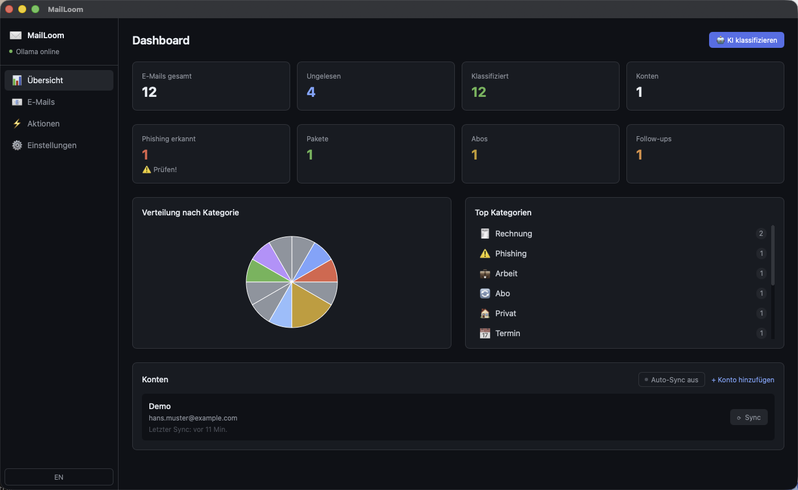

<div align="center">
  
  <h1>MailLoom</h1>

</div>

<p>Sortiert dein Postfach danach, was eine Mail tatsächlich ist, und zeigt dir jede Entscheidung, bevor sie greift</p>

[🇬🇧 English Version](README.md)

[](https://github.com/9t29zhmwdh-coder/MailLoom/actions) [](https://github.com/9t29zhmwdh-coder/MailLoom/security/code-scanning) [](https://securityscorecards.dev/viewer/?uri=github.com/9t29zhmwdh-coder/MailLoom) [](https://www.bestpractices.dev/projects/13696)

       [](https://github.com/9t29zhmwdh-coder/MailLoom/releases) [](LICENSE)

> **So läuft es:** MailLoom ist eine native Desktop-App, kein Server oder Browser-Tool. Sie öffnet sich als eigenes Fenster, ohne Tray-Icon oder Hintergrunddienst; sie synchronisiert und klassifiziert nur, während das Fenster geöffnet ist.



<sub>Screenshot mit erfundenen Demodaten. Absender und Betreffzeilen sind ausgedacht, es ist kein echtes Postfach zu sehen.</sub>

---

> 💾 [**Für macOS herunterladen**](https://github.com/9t29zhmwdh-coder/MailLoom/releases/latest/download/MailLoom.dmg) (DMG, immer das neueste Release): nicht signiert/notarisiert, macOS Gatekeeper zeigt beim ersten Start eine "nicht verifizierter Entwickler"-Warnung (Rechtsklick → Öffnen, um das zu umgehen). Oder selbst aus dem Quellcode bauen, siehe Erste Schritte unten. Windows/Linux werden nicht gebaut: MailLoom nutzt den macOS-Schlüsselbund und wird nur auf macOS getestet.

---

> 🌱 Neu hier? → [Schritt-für-Schritt-Anleitung für Einsteiger](GETTING_STARTED.md)

---

**Sortiert dein Postfach danach, was eine Mail tatsächlich ist, und zeigt dir jede Entscheidung, bevor sie greift.**

Mail-Regeln treffen auf einen Absender oder ein Wort im Betreff. Damit sind
Newsletter abgedeckt und sonst nichts, denn eine Rechnung, eine
Versandbestätigung und ein Phishing-Versuch kündigen sich im Header nicht an.
Also bleiben die Regeln halbfertig und das Postfach ein Haufen.

MailLoom liest jede Mail und ordnet sie in eine von 16 Kategorien ein:
Rechnung, Paket, Phishing, Arbeit, Newsletter und den Rest. Jeden Vorschlag
bestätigst oder korrigierst du, und nichts wird verschoben oder gelöscht,
bevor du es sagst.

**Du entscheidest, welches Modell deine Mail liest.** Ein lokales
Ollama-Modell ist die Voreinstellung, und damit verlässt kein Mailinhalt das
Gerät. Claude von Anthropic steht zur Wahl, wenn du das bevorzugst, dann gehen
Absender, Betreff und die ersten 800 Zeichen jeder klassifizierten Mail an
deren API. Die Wahl ist eine Einstellung, keine Build-Option, und
[PRIVACY.md](PRIVACY.md) schreibt aus, was jeweils übertragen wird.

Schnell-Login für iCloud, Microsoft 365, Gmail und Fastmail, ohne manuelle
Servereinstellungen. Mails liegen lokal in SQLite; Passwörter und der API-Key
im macOS-Schlüsselbund.

**Nichts für dich, wenn** sich deine Mail schon selbst sortiert. Wenn
Absenderregeln dein Postfach abdecken, sind die schneller und brauchen gar kein
Modell. Das hier ist für das Postfach, in dem zählt, *was* eine Mail ist, nicht
wer sie geschickt hat.

## Funktionen

| | Funktion | Status |
|---|---|---|
| **Sync** | iCloud, M365, Gmail, Fastmail, beliebiger IMAP | Fertig |
| **Kategorisierung** | 16 Kategorien: Newsletter, Rechnung, Paket, Arbeit, Phishing... | Fertig |
| **KI-Review** | Jede KI-Entscheidung prüfen und korrigieren, bevor sie gilt | Fertig |
| **Ordner-Browser** | Alle IMAP-Ordner anzeigen, KI-Reorganisationsvorschläge | Fertig |
| **E-Mails löschen** | Direkt in der App löschen, wird mit IMAP synchronisiert | Fertig |
| **Dashboard** | Stats, Kategorienverteilung, Sync pro Konto | Fertig |
| **Suche** | Volltextsuche über alle synchronisierten E-Mails | Fertig |
| **Multi-Account** | Mehrere IMAP-Konten in einem Dashboard | Fertig |
| **Keychain** | Passwörter nur im macOS-Schlüsselbund gespeichert | Fertig |
| **Regeln** | Regeln nach Kategorie, Absender, Betreff oder Text, als Vorschlag angelegt | Fertig |
| **IMAP-Aktionen** | Tatsächliches Verschieben auf dem Server nach Bestätigung | Fertig |

---

## Voraussetzungen

- [Rust](https://rustup.rs/) 1.96+
- [Node.js](https://nodejs.org/) 20+
- [Tauri CLI v2](https://tauri.app/): `cargo install tauri-cli`
- Ein [Anthropic API-Key](https://console.anthropic.com/) für die E-Mail-Klassifizierung
- macOS 13+ (Apple Silicon und Intel, Universal Binary)

---

## Schnellstart

```bash
git clone https://github.com/9t29zhmwdh-coder/MailLoom
cd MailLoom
cd frontend && npm install && cd ..
SQLX_OFFLINE=true cargo tauri dev
```

Beim ersten Start: **Einstellungen** öffnen, Anthropic API-Key einfügen (wird im macOS-Schlüsselbund gespeichert, nicht auf der Festplatte), IMAP-Konto hinzufügen. Auf dem Dashboard **Sync** klicken, dann **KI klassifizieren**.

---

## Deinstallation / Aufräumen

- App-Bundle löschen
- Lokale Datenbank entfernen: `~/Library/Application Support/com.raystudio.mailloom/`
- Gespeicherten API-Key und IMAP-Zugangsdaten aus der Schlüsselbundverwaltung.app entfernen (suche nach "claude-api-key" und deinen Konto-Bezeichnungen)

Es bleiben keine weiteren Dateien oder Hintergrunddienste zurück.

---

## KI-Backend

MailLoom nutzt [Claude](https://www.anthropic.com/claude) (Anthropic API) für E-Mail-Klassifizierung, Zusammenfassungen und Antwortvorschläge. Das erfordert einen eigenen Anthropic API-Key und eine Internetverbindung; E-Mail-Inhalte für die Klassifizierung verlassen dein Gerät und werden von der Anthropic API verarbeitet.

Standardmodell: `claude-haiku-4-5` (schnell, günstig), in den Einstellungen umstellbar auf `claude-sonnet-4-6` oder `claude-opus-4-8`.

---

## Datenschutz

E-Mails und Sync-Status werden lokal in SQLite gespeichert; ausser Anthropic (für Klassifizierungsanfragen) sieht niemand deine Daten. IMAP-Passwörter und der Anthropic API-Key werden im macOS-Schlüsselbund gespeichert und nie im Klartext auf die Festplatte geschrieben.

---

## Architektur

```
MailLoom/
├── crates/mp-core/      Rust: IMAP-Client, Klassifizierung, DB, Claude-API-Backend
├── crates/mp-cli/       CLI-Binary
├── src-tauri/           Tauri v2 Backend + IPC-Commands
└── frontend/            React + TypeScript + Tailwind + Recharts
```

---

**Autor:** [Rafael Yilmaz](https://github.com/9t29zhmwdh-coder) · **Status:** Aktiv · 
