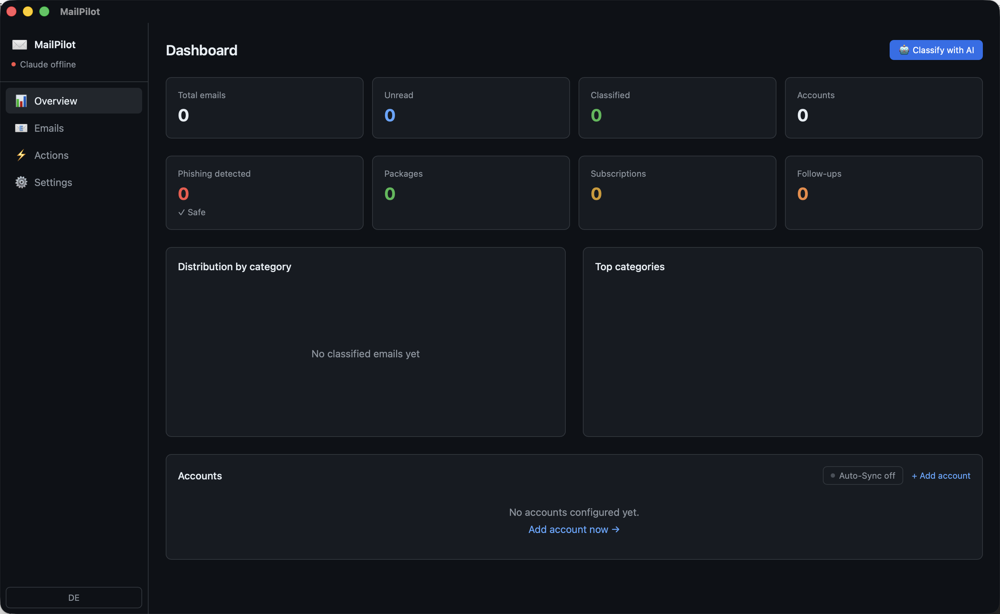

<div align="center">
  
  <h1>MailPilot</h1>
  <p>AI-powered email organizer with smart categorization, a review workflow and multi-account IMAP</p>
</div>

[🇩🇪 Deutsche Version](README.de.md)

[](https://github.com/9t29zhmwdh-coder/MailPilot/actions)       [](https://github.com/9t29zhmwdh-coder/MailPilot/releases) [](LICENSE)

> **How it runs:** MailPilot is a native desktop app, not a server or browser tool. It opens as its own window and has no tray icon or background service; it only syncs and classifies while the window is open.



---

MailPilot connects to your IMAP mailboxes, classifies every email using **Claude (Anthropic API)**, and lets you review and correct every decision before anything is moved or deleted. Emails are synced and stored locally in SQLite; classification requests go to Anthropic's API using your own API key, stored in the macOS Keychain.

Quick login for iCloud, Microsoft 365, Gmail and Fastmail, with no manual server setup.

**In practice:** you connect an account, sync your inbox, and let Claude categorize everything into 16 categories (Invoice, Package, Phishing, Newsletter...). You review or correct each suggestion before it's final; nothing is deleted or moved without your confirmation.

## Features

| | Feature | Status |
|---|---|---|
| **Sync** | iCloud, M365, Gmail, Fastmail, any IMAP | Done |
| **Categorization** | 16 categories: Newsletter, Invoice, Package, Work, Phishing... | Done |
| **AI Review** | Confirm or correct every AI decision before it takes effect | Done |
| **Folder Browser** | View all IMAP folders, get AI reorganization suggestions | Done |
| **Delete emails** | Delete directly from the app, synced to IMAP server | Done |
| **Dashboard** | Stats, category distribution, per-account sync | Done |
| **Search** | Full-text across all synced emails | Done |
| **Multi-Account** | Multiple IMAP accounts in one view | Done |
| **Keychain** | Passwords stored in macOS Keychain only | Done |
| **Rules** | Automatic rules per category (archive, delete, move...) | Planned |
| **IMAP actions** | Actually move emails on the server after confirmation | Planned |

---

## Requirements

- [Rust](https://rustup.rs/) 1.96+
- [Node.js](https://nodejs.org/) 20+
- [Tauri CLI v2](https://tauri.app/): `cargo install tauri-cli`
- An [Anthropic API key](https://console.anthropic.com/) for email classification
- macOS 13+

> 🌱 New here? → [Step-by-step guide for beginners](GETTING_STARTED.md)

---

## Quick Start

```bash
git clone https://github.com/9t29zhmwdh-coder/MailPilot
cd MailPilot
cd frontend && npm install && cd ..
SQLX_OFFLINE=true cargo tauri dev
```

On first launch, open **Settings**, paste your Anthropic API key (stored in the macOS Keychain, not on disk), and add an IMAP account. Click **Sync** on the Dashboard, then **Classify with AI**.

---

## Uninstall / Cleanup

- Delete the app bundle
- Remove the local database: `~/Library/Application Support/com.raystudio.mailpilot/`
- Remove the stored API key and IMAP credentials from Keychain Access.app (search for "claude-api-key" and your account labels)

No other files or background services are left behind.

---

## AI Backend

MailPilot uses [Claude](https://www.anthropic.com/claude) (Anthropic API) for email classification, summaries and reply suggestions. This requires your own Anthropic API key and an internet connection; email content sent for classification leaves your device and is processed by Anthropic's API.

Default model: `claude-haiku-4-5` (fast, low cost), configurable in Settings to `claude-sonnet-4-6` or `claude-opus-4-8`.

---

## Privacy

Emails and sync state are stored locally in SQLite; no third party except Anthropic (for classification requests) ever sees your data. IMAP passwords and the Anthropic API key are stored in the macOS Keychain and never written to disk in plain text.

---

## Architecture

```
MailPilot/
├── crates/mp-core/      Rust: IMAP client, classifier, DB, Claude API backend
├── crates/mp-cli/       CLI binary
├── src-tauri/           Tauri v2 backend + IPC commands
└── frontend/            React + TypeScript + Tailwind + Recharts
```

---

**Author:** [Rafael Yilmaz](https://github.com/9t29zhmwdh-coder) · **Status:** Active · 
