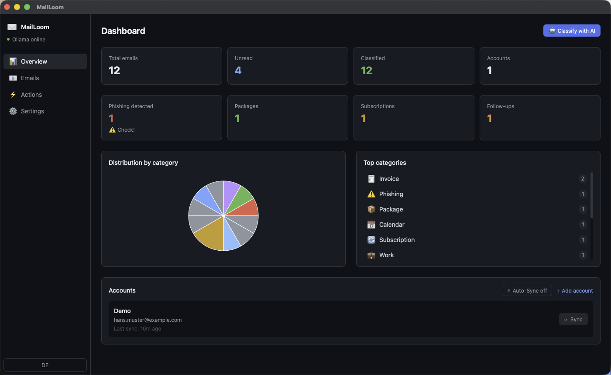

<div align="center">
  
  <h1>MailLoom</h1>

</div>

<p>AI-powered email organizer with smart categorization, a review workflow and multi-account IMAP</p>

[🇩🇪 Deutsche Version](README.de.md)

[](https://github.com/9t29zhmwdh-coder/MailLoom/actions) [](https://github.com/9t29zhmwdh-coder/MailLoom/security/code-scanning) [](https://securityscorecards.dev/viewer/?uri=github.com/9t29zhmwdh-coder/MailLoom) [](https://www.bestpractices.dev/projects/13696)

      [](https://github.com/9t29zhmwdh-coder/MailLoom/releases) [](LICENSE)

> **How it runs:** MailLoom is a native desktop app, not a server or browser tool. It opens as its own window and has no tray icon or background service; it only syncs and classifies while the window is open.



<sub>Screenshot with invented demo data. The senders and subjects are made up; no real mailbox is shown.</sub>

---

> 💾 [**Download for macOS**](https://github.com/9t29zhmwdh-coder/MailLoom/releases/latest/download/MailLoom.dmg) (DMG, always the latest release): not code-signed/notarized, so macOS Gatekeeper will show an "unidentified developer" warning on first run (right-click → Open to bypass). Or build from source, see Getting Started below. Windows/Linux are not built: MailLoom uses the macOS Keychain and is only tested on macOS.

---

> 🌱 New here? → [Step-by-step guide for beginners](GETTING_STARTED.md)

---

MailLoom connects to your IMAP mailboxes, classifies every email using **Claude (Anthropic API)**, and lets you review and correct every decision before anything is moved or deleted. Emails are synced and stored locally in SQLite; classification requests go to Anthropic's API using your own API key, stored in the macOS Keychain.

Quick login for iCloud, Microsoft 365, Gmail and Fastmail, with no manual server setup.

**In practice:** you connect an account, sync your inbox, and let Claude categorize everything into 16 categories (Invoice, Package, Phishing, Newsletter...). You review or correct each suggestion before it's final; nothing is deleted or moved without your confirmation.

## Features

| | Feature | Status |
|---|---|---|
| **Sync** | iCloud, M365, Gmail, Fastmail, any IMAP | Done |
| **Categorization** | 16 categories: Newsletter, Invoice, Package, Work, Phishing... | Done |
| **AI Review** | Confirm or correct every AI decision before it takes effect | Done |
| **Folder Browser** | View all IMAP folders, get AI reorganization suggestions | Done |
| **Delete emails** | Delete directly from the app, synced to IMAP server | Done |
| **Dashboard** | Stats, category distribution, per-account sync | Done |
| **Search** | Full-text across all synced emails | Done |
| **Multi-Account** | Multiple IMAP accounts in one view | Done |
| **Keychain** | Passwords stored in macOS Keychain only | Done |
| **Rules** | Rules by category, sender, subject or body, queued as proposals | Done |
| **IMAP actions** | Actually move emails on the server after confirmation | Done |

---

## Requirements

- [Rust](https://rustup.rs/) 1.96+
- [Node.js](https://nodejs.org/) 20+
- [Tauri CLI v2](https://tauri.app/): `cargo install tauri-cli`
- An [Anthropic API key](https://console.anthropic.com/) for email classification
- macOS 13+ (Apple Silicon and Intel, universal binary)

---

## Quick Start

```bash
git clone https://github.com/9t29zhmwdh-coder/MailLoom
cd MailLoom
cd frontend && npm install && cd ..
SQLX_OFFLINE=true cargo tauri dev
```

On first launch, open **Settings**, paste your Anthropic API key (stored in the macOS Keychain, not on disk), and add an IMAP account. Click **Sync** on the Dashboard, then **Classify with AI**.

---

## Uninstall / Cleanup

- Delete the app bundle
- Remove the local database: `~/Library/Application Support/com.raystudio.mailloom/`
- Remove the stored API key and IMAP credentials from Keychain Access.app (search for "claude-api-key" and your account labels)

No other files or background services are left behind.

---

## AI Backend

You choose which model classifies your email, and that choice decides whether any email content leaves your device.

| Setting | Runs on | What leaves the device |
|---|---|---|
| `ollama` (default) | your own [Ollama](https://ollama.com) instance, by default `localhost:11434` | nothing |
| `claude` | [Anthropic's API](https://www.anthropic.com/claude), with your own key | sender, subject and the first 800 characters of the body, per classified email |

The local path needs a running Ollama with a model pulled, `llama3` by default. The cloud path needs an API key in the Keychain; without one, classification reports an error instead of quietly switching to the local model, so the two never substitute for each other unnoticed.

Cloud models: `claude-haiku-4-5` by default, configurable to `claude-sonnet-4-6` or `claude-opus-4-8`.

**Before enabling the cloud path**, note that the content sent belongs to the people who wrote to you, and they did not agree to it. If your mail falls under the Swiss FADP, the GDPR, professional confidentiality or an employment contract, check whether forwarding it to a third party is permitted.

---

## Privacy

Emails and sync state are stored locally in SQLite. With the default local model no third party sees your mail at all; with the cloud model, classification requests reach Anthropic and nothing else does. IMAP passwords and the API key are stored in the macOS Keychain and never written to disk in plain text. See [PRIVACY.md](PRIVACY.md) for what exactly is transmitted.

---

## Architecture

```
MailLoom/
├── crates/mp-core/      Rust: IMAP client, classifier, DB, Claude API backend
├── crates/mp-cli/       CLI binary
├── src-tauri/           Tauri v2 backend + IPC commands
└── frontend/            React + TypeScript + Tailwind + Recharts
```

---

**Author:** [Rafael Yilmaz](https://github.com/9t29zhmwdh-coder) · **Status:** Active · 
